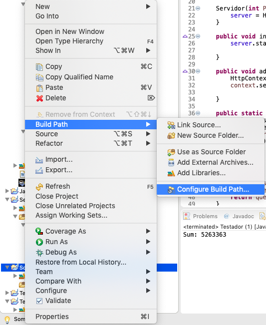

# Projeto MC322 Grupo JAEE
~~~
170442 - Emanuel de Souza Oliveira  
215394 - Enzo Hideki Iwata
218615 - João Gabriel Segato Kruse
212466 - Álvaro Marques Macedo
~~~
# Componentes
obs: Ler o README de cada componente em sua respectiva pasta para ver suas exigências
# Componente `Speak`
Campo | Valor
----- | -----
Classe | speak.Speak
Autores | `Enzo Iwata, João Kruse, Emanuel Oliveira, Álvaro Marques`
Objetivo | `Converte o texto para áudio e executa `
Interface | -

~~~
public class Speak{
  public static void speak(String texto);
}
~~~
Exige a instalação do JAR em: https://github.com/watson-developer-cloud/java-sdk/releases/download/java-sdk-7.0.0/ibm-watson-7.0.0-jar-with-dependencies.jar

## Detalhamento das Interfaces
### Interface `Speak`
`Classe que contem metodo que recebe uma string com texto e a reproduz na forma de audio com a pronuncia do ingles`.

Método | Objetivo
-------| --------
`speak` | `Metodo estatico que recebe uma String e reproduz um audio do texto. Funçao void`

# Componente `Tradutor`

Campo | Valor
----- | -----
Classe | tradutor.Translate
Autores | `Enzo Iwata, João Kruse, Emanuel Oliveira, Álvaro Marques`
Objetivo | `Tradução de textos de qualquer lingua com suporte no Google Tradutor para português ou inglês `
Interface | -

~~~
public class Translate{
  String translate(String frase);
  String translate(String frase, String lingua);
}
~~~
Exige a instalação do JAR em: https://github.com/watson-developer-cloud/java-sdk/releases/download/java-sdk-7.0.0/ibm-watson-7.0.0-jar-with-dependencies.jar

## Detalhamento das Interfaces
### Interface `Tradutor`
`Classe com metodo que recebe uma frase em formato de string e traduz para inglês como padrão, caso o usuário deseje ele pode colocar como parâmetro uma língua para se traduzir`.

Método | Objetivo
-------| --------
`traduz` | `Metodo estatico que traduz uma string para inglês como padrão ou para uma língua desejada por sobrecarga de métodos. Retorna a String traduzida`

# Componente `Temperamental`
Campo | Valor
----- | -----
Classe | Temperamental.* 
Autores | `Enzo Iwata, João Kruse, Emanuel Oliveira, Álvaro Marques`
Objetivo | `Simula um medico com diferentes temperamentos, que vai se estressando com o passar do tempo `
Interface | `Estresse, TemperamentoGeral`

~~~

public abstract class Estresse{
  public void novoPaciente();
  public void novaPergunta();
 }
 
 public class TemperamentoGeral{
    public static IFabricaStress CriaTemperamento(String tipo);
}

~~~
## Detalhamento das Interfaces
### Interface `Estresse`
`Classe que contem os metodos de update para que se gere uma frase dependedo da situacao`.

Método | Objetivo
-------| --------
`novoPaciente` | `Imprime uma mensagem(ou não) após a consulta com um paciente, e mostra o que o médico quer fazer ou de sua situação mental. Método precisa ser chamado sempre que acabar uma consulta`
`novaPergunta` | `Imprime uma mensagem(ou não) após uma pergunta ao paciente, e mostra o que o médico quer fazer ou de sua situação mental. Método precisa ser chamado sempre que o medico fizer uma pergunta`

### Interface `TemperamentoGeral`
`Fabrica de medicos com temperamentos diferentes`

Método | Objetivo
-------| --------
`CriaTemperamento` | `Recebe como parametro uma String, dentre elas podendo ser: calmo, puto, putasso, real e unico; a opcao de unico gerara uma situacao para um unico paciente, assim o temperamento do medico mudara com a quantidade de perguntas e pela demora com que elas foram feitas; as opções restantes servem para o caso de um medico que atende varios pacientes, assim simulando o dia de um medico; os outros sao autoexplicativos, o real passa pelos outros estados de forma respectiva indo do medico calmo para o puto e depois para o putasso.`

# Componente Interface Gráfica para Web
| Campo | Valor |
| ------------- | ------------- |
| Classe |	<caminho completo da classe com pacotes> |
| Autores | João Kruse, Enzo Iwata, Emanuel Oliveira e Álvaro Marques |
| Objetivo | Exibir um gráfico de curva de nível com a relação sintomas x doenças, analisando seu comportamento |
| Interface | IGraphWeb |
~~~
public interface IGraphWeb extends IDataSet{
  public int countSintomasDoencas();
  public int regraTres(int t, int n);
  public String[] cores(); //rgb(0,0,255) -> rgb(0,255,0)
  public String[][] coresSintomasDoencas();
  public String[][] constroiGraph();
  public String[][] geraCSV();
}
  
  
~~~
# Interface IGraphWeb
## Exibir um gráfico de curvas de nível mostrando a relação dos sintomas com as doenças
| Método | Objetivo |
| ------------- | ------------- |
| countSintomasDoencas() | Esse método conta quantas vezes determinado sintoma aparece na doença e contabiliza |
| regraTres() | Recebe o número total de diagnósticos da doença e o número que o sintoma aparece, converte para uma escala de 0 a 255 |
| cores() | Faz uma requisição na regraTres() e constrói uma String rgb com a cor do ponto no gráfico |
| coresSintomasDoencas() | Retorna uma String com as cores dos pontos Doença x Sintoma, por uma média ponderada |
| constroiGraph() | A partir das coresSintomasDoencas(), constrói o restante do gráfico com as cores de cada ponto/pixel, criando visualmente a curva de nível |
| geraCSV() | salva o gráfico em um arquivo csv, cor por coordenada, que será lido pelo programa web com JavaScript |

#Interface IServidor
##Cria um servidor HTTP para realizar troca de informações entre diferentes programas

| Método | Objetivo |
| ------------- | ------------- |
| initialize() | Inicia o Servidor |
| addContext(String path, HttpHandler h)  | Adiciona rota ao servidor e seu respectivo Handler |

##Tutorial de como fazer o seu servidor:

Olá, se você está lendo isso tem a chance de querer utilizar nosso servidor :)

Primeiramente, aqui está a referência das classes do componente: [FAZER REFERÊNCIA DO ROLÊ]

Nesse tutorial, vamos aprender a fazer um servidor recebe do cliente dois números inteiros e retorna a soma deles

Para começar, precisamos que você habilite o package com.sun.net.httpserver no seu projeto do eclipse, para fazer isso siga esses passos:
1. Configure o Build Path do seu projeto:  

2. Vá e 
  

